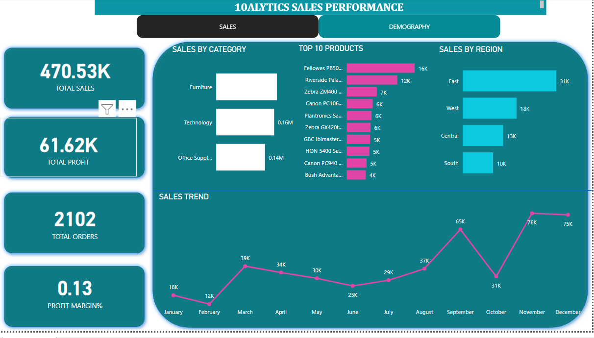
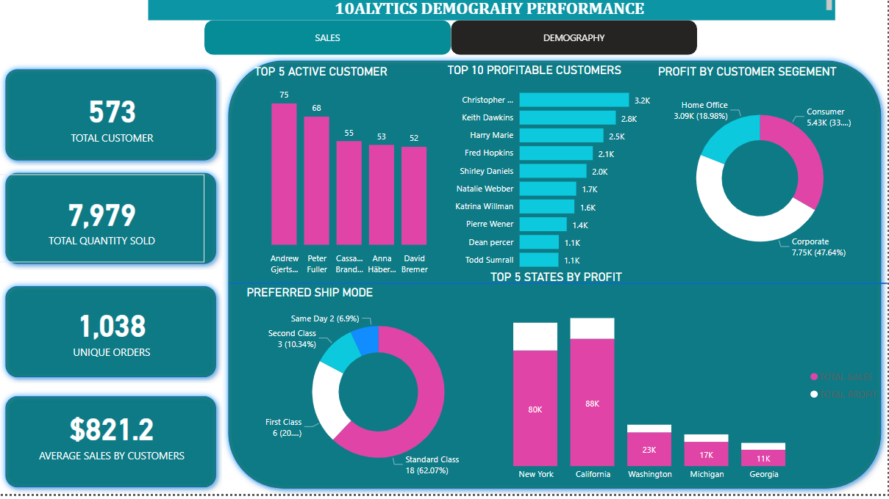

# SUPER STORES SALES PERFORMANCE

## DISCLAIMER:
All dataset and reports do not represent any company,institution or country but just a dummy dataset to demostrate capabilities of powerbi

## INTRODUCTION:
 Presenting super stores data visualization containing large datasets covering a 1-year period,this Dataset includes information on transaction type, product, shipping mode,customer details and regions.

 ## PROBLEM STATEMENT:
 Develop and implement a comprehensive Business Intelligence (BI) solution that enables tracking of key performance indicators (KPIs) such as sales, profit, profit margin, regional performance comparison, product-level trend analysis, and identification of high-value customers.

## SKILLS DEMOSTRATED:
- problem solving
- data discovery
- data cleaning and ETL
- normalisation
- models
- measures
- slicers
- dashboard and data visualisation
- key finfings

  ## DATA SOURCING
- sales,
-  profit,
-  profit margin,
- regional performance comparison,
- product-level trend analysis,
- identification of high-value customers.

## DATA INFORMATION
. Dataset included information on 
- transaction type,
- product,
- shipping mode,
- customer details and regions.

## MODELLING:
  Automatically derived relationship are adjusted to remove and replace unwanted relationship with the required
  
  There are five dimension tables and 1 fact table.The dimension tables are all joined to the fact table in the auto model table with a one to many relationship
  
  The model is a star schema
  
  

  ## ANYLSIS AND VISUALISATION

 

