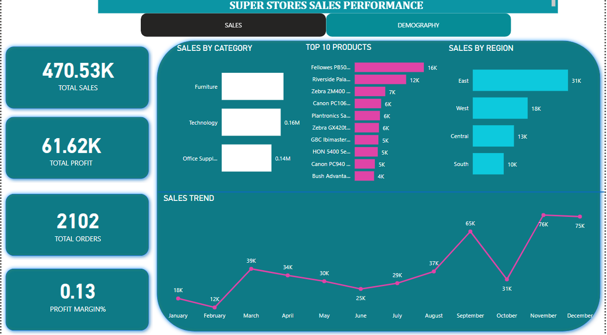
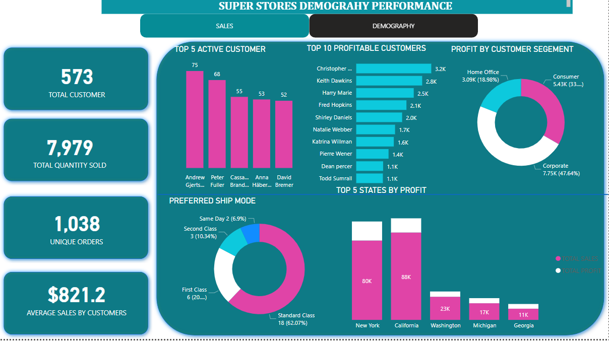

# 10ALYTICS SUPER STORES SALES PERFORMANCE

## DISCLAIMER:
All dataset and reports do not represent any company,institution or country but just a dummy dataset to demostrate capabilities of powerbi

## INTRODUCTION:
 Presenting super stores data visualization containing large datasets covering a 1-year period,this Dataset includes information on transaction type, product, shipping mode,customer details and regions.

 ## PROBLEM STATEMENT:
 Develop and implement a comprehensive Business Intelligence (BI) solution that enables tracking of key performance indicators (KPIs) such as sales, profit, profit margin, regional performance comparison, product-level trend analysis, and identification of high-value customers.

## SKILLS DEMOSTRATED:
- problem solving
- data discovery
- data cleaning and ETL
- normalisation
- models
- measures
- slicers
- dashboard and data visualisation
- key finfings

  ## DATA SOURCING
- sales,
-  profit,
-  profit margin,
- regional performance comparison,
- product-level trend analysis,
- identification of high-value customers.

## DATA INFORMATION
. Dataset included information on 
- transaction type,
- product,
- shipping mode,
- customer details and regions.

## MODELLING:
  Automatically derived relationship are adjusted to remove and replace unwanted relationship with the required
  
  There are five dimension tables and 1 fact table.The dimension tables are all joined to the fact table in the auto model table with a one to many relationship
  
  The model is a star schema
  
  

  ## ANAYLSIS AND VISUALISATION:

- a The total sales reached 470.53k, resulting in a profit of 61.62k and a profit margin of 13.10%.
- b The visualization indicates that Furniture was the top-selling product, contributing $0.17m, which accounts for over 36% of the total sales value.
- c The Eastern Region demonstrated the highest performance, contributing $0.16m, which represents approximately 34% of the total sales.
- d Analysis of sales trends over a one-year period, as depicted by the line chart, reveals an overall improvement. However, a significant decline occurred in October. Further examination using filters revealed that the top 4 products experienced low sales during that period. It is recommended to ensure consistent production and availability of these products while also focusing on increasing the market share of other products to compensate for such occurrences in the future

- e The Clustered column chart represents the top 5 active customers based on their value.
- f The Doughnut pie chart highlights the most profitable customer segment, with individual consumers contributing 46% of the total profit. Additionally, it is worth noting that a significant number of customers prefer the standard class shipping mode.
- g The final Bar chart illustrates that California recorded higher sales, while New York generated a larger profit contribution.

## CONCLUSION AND RECOMMENDATIONS:

 In conclusion, it is essential to implement effective strategies to attract and retain more customers in order to increase and improve the overall profit share.

Your reviews will be much appreciated.....

 

