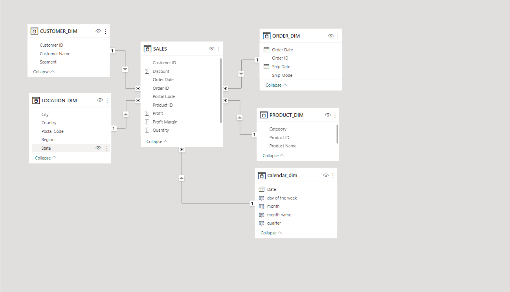

# SUPER STORES SALES PERFORMANCE

## DISCLAIMER:
All dataset and reports do not represent any company,institution or country but just a dummy dataset to demostrate capabilities of powerbi

## INTRODUCTION:
 Presenting super stores data visualization containing large datasets covering a 1-year period,this Dataset includes information on transaction type, product, shipping mode,customer details and regions.

 ## PROBLEM STATEMENT:
 Develop and implement a comprehensive Business Intelligence (BI) solution that enables tracking of key performance indicators (KPIs) such as sales, profit, profit margin, regional performance comparison, product-level trend analysis, and identification of high-value customers.

## SKILLS DEMOSTRATED:
- Problem solving
- Data discovery
- Data cleaning and ETL
- Normalisation
- Models
- Measures
- Slicers
- Dashboard and data visualisation
- Key finfings

## MODELLING:
  Automatically derived relationship are adjusted to remove and replace unwanted relationship with the required
  
  The model is a star schema
  
  

